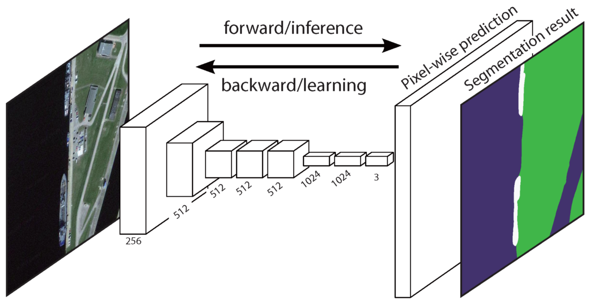

<center>
# CSC 449 Final Project Report
### Team: We need to go deeper
### Jong Hwi Park, Kefu Zhu
</center>

## Task 2: Actor-Action Segmentation

#### 1. Pre-processing

- **Rotation**: Rotate the image randomly between `-10` degree and `+10` degree
- **Flip**: Flip the image with `50%` chance
- **Cropping**: Randomly crop the image given `crop_size = [244, 244]`
- **Padding**: Randomly pad the image given `crop_size = [244, 244]`
- **Rescale**: Randomly sacle the image between `0.5` and `2.0`
- **Blur**: Smooth the image with `50%` chance with a gaussian filter of size `5x5` with sigma matrix of `[1e-6, 0.6]`

By doing the pre-processing above, we added some noises into our training data and make the model more robust in the prediction stage.

#### 2. Network architecture

We used the
[**FCN32s**](https://www.cv-foundation.org/openaccess/content_cvpr_2015/papers/Long_Fully_Convolutional_Networks_2015_CVPR_paper.pdf) model, which is widely used as a baseline model. With VGG16 backbone model, we changed the final output layer to perform up-sampling that has same size as the input image size.

<center>


Figure 4. Model Structure for Fully Convolutional Networks (FCN)
</center>

#### 3. Loss and Accuracy

For Loss function, we used cross entropy loss function for 2D data, since we are calculating loss for each pixel and sum them up all together.

#### 4.Optimization method

We train the model with batch size `12` and used `(stochastic gradient descent)` to optimize the model with step-wise learning rate and momentum of `0.9`. 

```
Epoch:1-15		Learning rate:1e-10
Epoch:16-31		Learning rate:5e-11
Epoch:32-50		Learning rate:2.5e-11
```

#### 5.Novelty of our method

We tried to train multiple models ranging from PSPNet, SegNet, UNet. However, due to unresolved circumstance that the weight for background label dominated the learning process, we employed FCN32s as TA recommended.

For FCN32s, we trained 50 epochs with step-wise decreasing learning rate, as mentioned above.

### Performance on validation set

The fine-tuned FCN32s model can reach `Accuracy: 35.35 Mean IoU: 25.33` on the validation dataset

## Appendix

**Cross Entropy Loss for 2D**

```python
def cross_entropy2d(input,target,weight=None,size_average=False):
   n,c,h,w = input.size()
   log_p = F.log_softmax(input,dim=1)

   log_p = log_p.transpose(1,2).transpose(2,3).contiguous()
   log_p = log_p[target.view(n,h,w,1).repeat(1,1,1,c) >=0]
   log_p = log_p.view(-1,c)

   mask = target>=0
   target = target[mask]
   loss = F.nll_loss(log_p,target,weight=weight,reduction='sum')
   if size_average:
       loss/=mask.data_sum()
   return loss
```