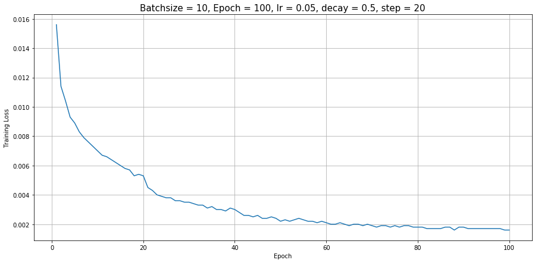
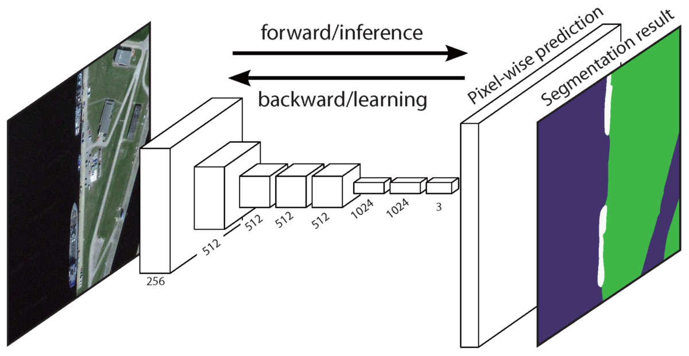

<center>
# CSC 449 Final Project Report
### Team: We need to go deeper
### Jong Hwi Park, Kefu Zhu
</center>

## Task 1: Multi-Label Actor-Action Classification

### Model description 

#### 1. Pre-processing

- **Rotation**: Rotate the image randomly between `-10` degree and `+10` degree
- **Flip**: Flip the image with `50%` chance
- **Cropping**: Randomly crop the image given `crop_size = [244, 244]`
- **Padding**: Randomly pad the image given `crop_size = [244, 244]`
- **Rescale**: Randomly sacle the image between `0.5` and `2.0`
- **Blur**: Smooth the image with `50%` chance with a gaussian filter of size `5x5` with sigma matrix of `[1e-6, 0.6]`
- **Resize**: Resize the image to `299x299` for inception_v3 model 

By doing the pre-processing above, we added some noises into our training data and make the model more robust in the prediction stage.

#### 2. Network architecture

We used the [**inception_v3**](https://arxiv.org/abs/1512.00567) model pre-trained on ImageNet. 

<center>


Figure 1. Model Structure for Inception_v3
</center>


Because we want to maintain the features extracted by the pre-trained **inception_v3** model, so we freezed all convolutional layers and fine-tuning the model by updating the parameters in the rest layers.

Below is the list of names for all layers within **inception_v3**

```
# Layer names
['Conv2d_1a_3x3',
 'Conv2d_2a_3x3',
 'Conv2d_2b_3x3',
 'Conv2d_3b_1x1',
 'Conv2d_4a_3x3',
 'Mixed_5b',
 'Mixed_5c',
 'Mixed_5d',
 'Mixed_6a',
 'Mixed_6b',
 'Mixed_6c',
 'Mixed_6d',
 'Mixed_6e',
 'AuxLogits',
 'Mixed_7a',
 'Mixed_7b',
 'Mixed_7c',
 'fc']
```

In order to predict on our dataset, we edited the output of fully-connected layers for both the primary net and the auxiliary net to `43`


#### 3. Loss and Accuracy

We used the [`nn.BCEWithLogitsLoss()`](https://pytorch.org/docs/stable/nn.html) as our loss function. 

<center>
$Loss = \{l_1,...,l_N\},\ l_n = -w_n[y_n \cdot log \sigma(x_n) + (1-y_n) \cdot log(1-\sigma(x_n))]$
</center>

The total loss is the combination of loss from both **primary net** and **auxiliary net**

<center>
$Loss = loss_{primary} + 0.3 \cdot loss_{auxiliary}$


Figure 2. Training Loss for Inception_v3


Figure 3. Traning Accuracy for Inception_v3
</center>

#### 4. Optimization method

We train the model with mini-batch of size `10` and used the stochastic gradient descent (`optim.SGD`) to optimize the model with step-wise learning rate and momentum of `0.9`

```
Epoch:1-20		Learning rate:0.05
Epoch:21-40		Learning rate:0.025
Epoch:41-60		Learning rate:0.0125
Epoch:61-80		Learning rate:0.00625
Epoch:81-90		Learning rate:0.003125
Epoch:91-100	Learning rate:0.0015625
```

#### 5. Number of epochs to convergence

As shown in the figures in the section above, we can clearly see the model is converged roughly around `60` epochs

### Novelty of your method

We freezed the convolutional layers in the pre-trained inception_v3 model and trained the model with step-wise learning rate

### Performance on validation set

The fine-tuned inception_v3 model can reach `Precision: 47.6 Recall: 50.0 F1: 46.9` on the validation dataset

## Task 2: Actor-Action Segmentation

#### 1. Pre-processing

Same method from Multi-Label Actor-Action Classification to pre-process the data was employed

#### 2. Network architecture

We used the
[**FCN32s**](https://www.cv-foundation.org/openaccess/content_cvpr_2015/papers/Long_Fully_Convolutional_Networks_2015_CVPR_paper.pdf) model, which is widely used as a baseline model. With VGG16 backbone model, we changed the final output layer to perform up-sampling that has same size as the input image size.

<center>


Figure 4. Model Structure for Fully Convolutional Networks (FCN)
</center>

#### 3. Loss and Accuracy

For Loss function, we used cross entropy loss function for 2D data, since we are calculating loss for each pixel and sum them up all together.

#### 4.Optimization method

We train the model with batch size `12` and used `(stochastic gradient descent)` to optimize the model with step-wise learning rate and momentum of `0.9`. 

```
Epoch:1-15		Learning rate:1e-10
Epoch:16-31		Learning rate:5e-11
Epoch:32-50		Learning rate:2.5e-11
```

#### 5.Novelty of our method

We tried to train multiple models ranging from PSPNet, SegNet, UNet. However, due to unresolved circumstance that the weight for background label dominated the learning process, we employed FCN32s as TA recommended.

For FCN32s, we trained 50 epochs with step-wise decreasing learning rate, as mentioned above.

### Performance on validation set

The fine-tuned FCN32s model can reach `Accuracy: 35.35 Mean IoU: 25.33` on the validation dataset

## Appendix

**Extract loss and accuracy from training log**

```python
def extract_log(log_file):
    # Required module
    import re
    import numpy as np
    # Initialize a numpy array to store epoch number
    epoch_array = np.array([])
    # Initialize a numpy array to store extracted loss
    loss_array = np.array([])
    # Initialize a numpy array to store extracted accuracy
    acc_array = np.array([])
    
    epoch_counter = 0
    
    with open(log_file,'r') as f:
        for line in f.readlines():
            if re.match(r'^Loss.*',line):
                epoch_counter += 1
                epoch_array = np.append(epoch_array, epoch_counter)
                
                loss, acc = re.findall(r'(0.\d*)',line)
                loss = float(loss)
                acc = float(acc)
                loss_array = np.append(loss_array, loss)
                acc_array = np.append(acc_array, acc)
                
    # Close the file            
    f.close()
                
    log = {'epoch':epoch_array,'loss':loss_array,'accuracy':acc_array}
    
    return log
```

**Cross Entropy for 2D**

```python
def cross_entropy2d(input,target,weight=None,size_average=False):
   n,c,h,w = input.size()
   log_p = F.log_softmax(input,dim=1)

   log_p = log_p.transpose(1,2).transpose(2,3).contiguous()
   log_p = log_p[target.view(n,h,w,1).repeat(1,1,1,c) >=0]
   log_p = log_p.view(-1,c)

   mask = target>=0
   target = target[mask]
   loss = F.nll_loss(log_p,target,weight=weight,reduction='sum')
   if size_average:
       loss/=mask.data_sum()
   return loss
```
