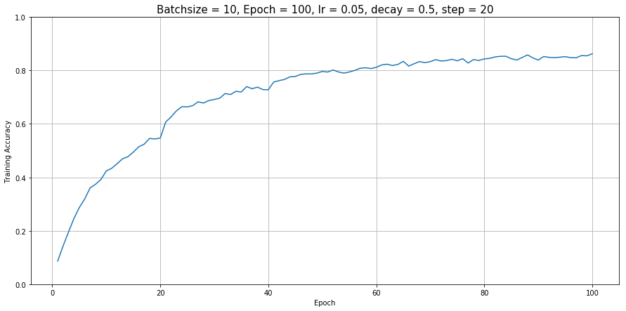

<center>
# CSC 449 Final Project Report
### Team: We need to go deeper
### Jong Hwi Park, Kefu Zhu
</center>

## Task 1: Multi-Label Actor-Action Classification

### Model description 

#### 1. Pre-processing

- **Rotation**: Rotate the image randomly between `-10` degree and `+10` degree
- **Flip**: Flip the image with `50%` chance
- **Cropping**: Randomly crop the image given `crop_size = [244, 244]`
- **Padding**: Randomly pad the image given `crop_size = [244, 244]`
- **Rescale**: Randomly sacle the image between `0.5` and `2.0`
- **Blur**: Smooth the image with `50%` chance with a gaussian filter of size `5x5` with sigma matrix of `[1e-6, 0.6]`
- **Resize**: Resize the image to `299x299` for inception_v3 model 

By doing the pre-processing above, we added some noises into our training data and make the model more robust in the prediction stage.

#### 2. Network architecture

We used the [**inception_v3**](https://arxiv.org/abs/1512.00567) model pre-trained on ImageNet. 

Because we want to maintain the features extracted by the pre-trained **inception_v3** model, so we freezed all convolutional layers and fine-tuning the model by updating the parameters in the rest layers.

Below is the list of names for all layers within **inception_v3**

```
# Layer names
['Conv2d_1a_3x3',
 'Conv2d_2a_3x3',
 'Conv2d_2b_3x3',
 'Conv2d_3b_1x1',
 'Conv2d_4a_3x3',
 'Mixed_5b',
 'Mixed_5c',
 'Mixed_5d',
 'Mixed_6a',
 'Mixed_6b',
 'Mixed_6c',
 'Mixed_6d',
 'Mixed_6e',
 'AuxLogits',
 'Mixed_7a',
 'Mixed_7b',
 'Mixed_7c',
 'fc']
```

In order to predict on our dataset, we edited the output of fully-connected layers for both the primary net and the auxiliary net to `43`


#### 3. Loss and Accuracy

We used the [`nn.BCEWithLogitsLoss()`](https://pytorch.org/docs/stable/nn.html) as our loss function. 

<center>
$Loss = \{l_1,...,l_N\},\ l_n = -w_n[y_n \cdot log \sigma(x_n) + (1-y_n) \cdot log(1-\sigma(x_n))]$
</center>

The total loss is the combination of loss from both **primary net** and **auxiliary net**

<center>
$Loss = loss_{primary} + 0.3 \cdot loss_{auxiliary}$



</center>

#### 4. Optimization method

We train the model with mini-batch of size `10` and used the stochastic gradient descent (`optim.SGD`) to optimize the model with step-wise learning rate and momentum of `0.9`

```
Epoch 1-20		Learning rate:0.05
Epoch:21-40		Learning rate:0.025
Epoch:41-60		Learning rate:0.0125
Epoch:61-80		Learning rate:0.00625
Epoch:81-90		Learning rate:0.003125
Epoch:91-100	Learning rate:0.0015625
```

#### 5. Number of epochs to convergence

As shown in the figures in the section above, we can clearly see the model is converged roughly around `60` epochs

### Novelty of your method

We freezed the convolutional layers in the pre-trained inception_v3 model and trained the model with step-wise learning rate

### Performance on validation set

The fine-tuned inception_v3 model can reach `Precision: 47.6 Recall: 50.0 F1: 46.9` on the validation dataset